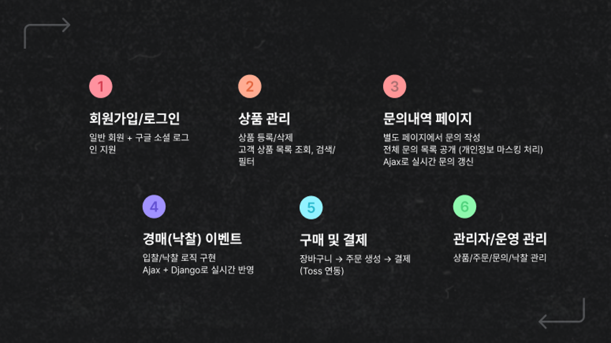

<h1>중고 쇼핑몰 웹 서비스 프로젝트</h1>

## 프로젝트 개요
<big>
1명의 판매자가 다양한 상품을 등록하고, 여러 고객이 이를 구매할 수 있는 중고 거래 쇼핑몰 웹 서비스입니다. 
일반 구매 방식뿐만 아니라 <strong>낙찰 이벤트(경매 방식)</strong>를 도입하여 고객들이 흥미롭게 참여할 수 있도록 구현하였습니다.
</big>

## 팀 멤버 소개

| **김윤석** | **김윤정** | **김형준** | **송윤석** |
| :------: | :------: | :------: | :------: |
|[ @Monzi](https://github.com/Dusty-Miller)|[ @beautiyj](https://github.com/beautiyj)|[ @KimHyeongjun](https://github.com/Ayewww)|[ @SongYunSeok0](https://github.com/SongYunSeok0/SongYunSeok0.github.io)|

## 개발 환경

Front-end:
   

 

Back-end:
  

 

Database:

 

서버 구성:

 

협업 툴:

## 프로젝트 

## 시스템 구성도

## 시연 영상

<button>https://youtu.be/sCDBcvCAMvE?si=D9-1Yl2WOt98wo1N></a></button>
   

### 발표용 링크
<h4>http://3.80.21.12:8000/</h4>
